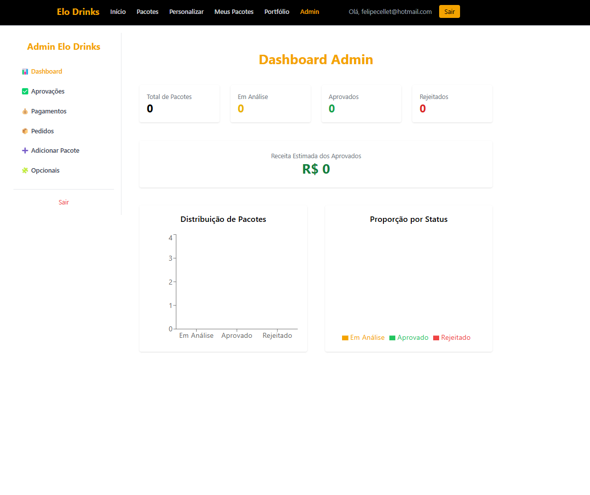

# elo-drinks-firebase

# 🍹 Elo Drinks

Sistema web desenvolvido para facilitar a contratação de pacotes de drinks e serviços personalizados para festas e eventos. Com uma interface moderna e intuitiva, o app permite ao usuário contratar pacotes prontos, montar pacotes personalizados, acompanhar status de pedidos e realizar a administração completa via painel exclusivo.


---

## 🚀 Funcionalidades

- 💼 Pacotes prontos com cálculo automático por número de pessoas
- 🧑‍🍳 Montagem de pacotes personalizados com seleção de bebidas, insumos e equipe
- 📍 Preenchimento automático de cidade e estado via CEP
- ✅ Confirmação e acompanhamento de pedidos
- 🔐 Autenticação de usuários com Firebase Auth
- 📊 Painel Admin com:
  - Aprovação de pedidos
  - Cadastro de novos pacotes e opcionais
  - Visualização de status de pagamento
- 🔥 Integração com Firestore para dados em tempo real

---

## 🛠️ Tecnologias Utilizadas

- **React.js** com Vite
- **Firebase** (Auth, Firestore, Hosting)
- **React Router Dom**
- **Framer Motion** para animações
- **TailwindCSS** para estilização
- **Jest** e **Cypress** para testes
- **React Datepicker** para seleção de datas

---

## 📸 Imagens do Projeto

| Home (Mobile) | Wizard Personalizado | Painel Admin |
|---|---|---|
|  |  |  |

---

## ⚙️ Instalação

### 1. Clone o repositório

```bash
git clone https://github.com/seu-usuario/elo-drinks.git
cd elo-drinks
```

### 2. Instale as dependências

```bash
npm install
```

### 3. Configure o Firebase

Crie um arquivo `firebase.js` dentro da pasta `src/` com as suas credenciais do Firebase:

```js
import { initializeApp } from "firebase/app";
import { getAuth } from "firebase/auth";
import { getFirestore } from "firebase/firestore";

const firebaseConfig = {
  apiKey: "SUA_API_KEY",
  authDomain: "SEU_DOMINIO",
  projectId: "SEU_PROJECT_ID",
  storageBucket: "SEU_BUCKET",
  messagingSenderId: "SEU_SENDER_ID",
  appId: "SEU_APP_ID",
};

const app = initializeApp(firebaseConfig);
const auth = getAuth(app);
const db = getFirestore(app);

export { auth, db };
```

### 4. Execute o projeto localmente

```bash
npm run dev
```

---

## 🧪 Testes

### Testes unitários com Jest

```bash
npm test
```

### Testes de sistema/integrados com Cypress

```bash
npx cypress open
```

---

## 📁 Estrutura de Pastas

```
📦elo-drinks
 ┣ 📂public
 ┣ 📂src
 ┃ ┣ 📂components
 ┃ ┣ 📂pages
 ┃ ┣ 📂__tests__
 ┃ ┣ firebase.js
 ┣ 📜README.md
 ┣ 📜package.json
 ┣ 📜vite.config.js
```

---

## 👨‍💻 Desenvolvedor

| [Felipe Cellet (GEC1775)](https://github.com/FelipeCellet) |
|:--:|

---


- INATEL – Instituto Nacional de Telecomunicações  
- Professores e colegas que contribuíram no desenvolvimento do projeto  
- Firebase, React e toda comunidade open-source
